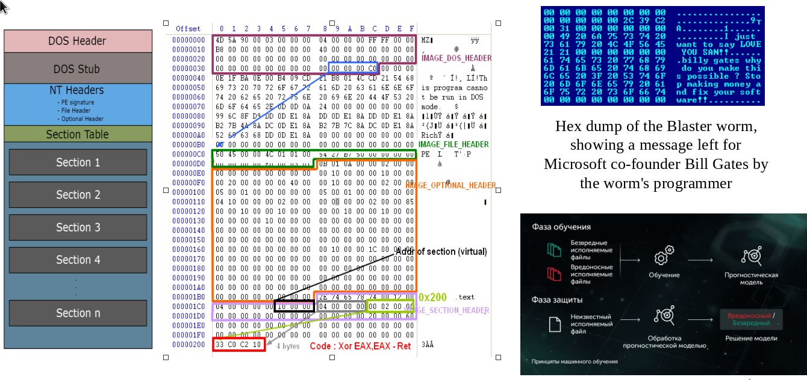
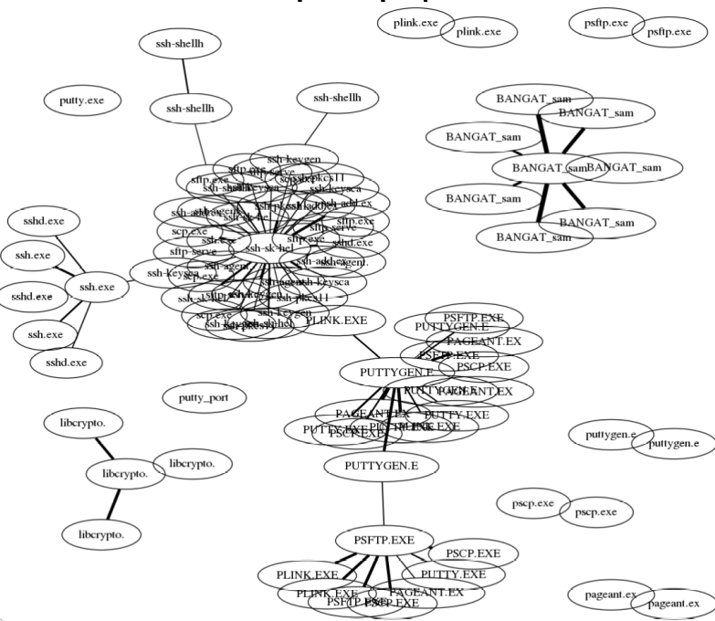
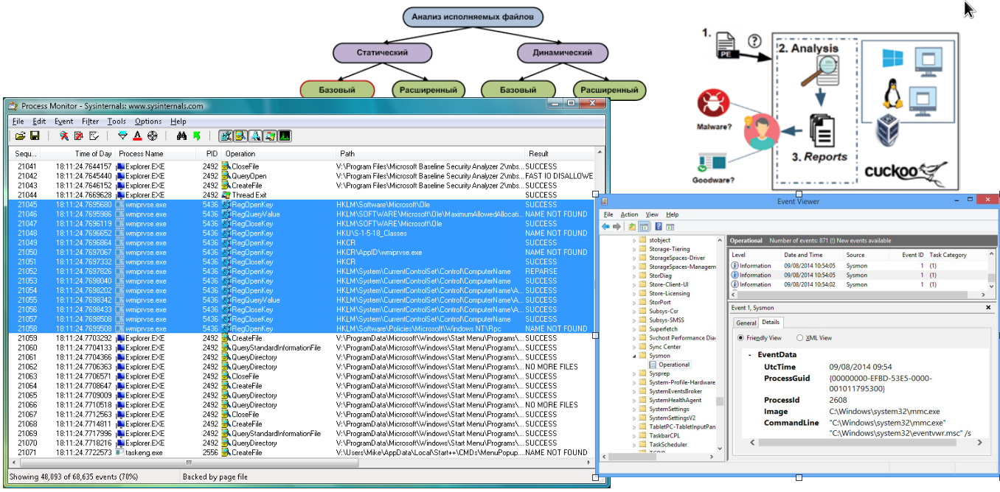
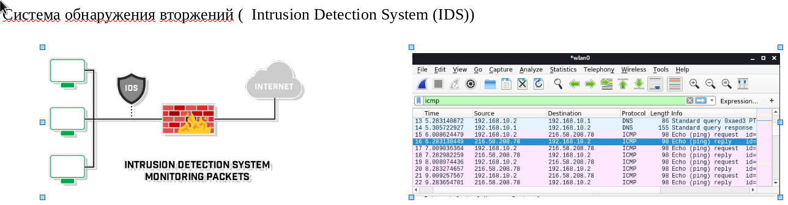
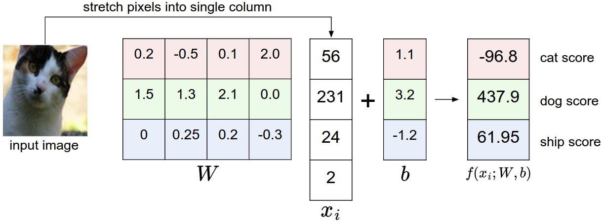

# Введение в машинное обучение
## Для специальности «Компьютерная безопасность»

---

## Содержание / Outline

1. Что такое машинное обучение? 
2. Типы задач и математическая постановка
3. Признаки и инжиниринг признаков (Features & Feature Engineering)
4. Разделение выборок (Data Splitting)
5. Метрики качества (Evaluation Metrics)
6. Дискриминативные vs генеративные модели
7. Примеры в кибербезопасности
8. Большие языковые модели (LLMs) в безопасности
9. Заключение

---
 ## Анализ бинарных файлов для обнаружения вредоносного программного обеспечения с использованием методов машинного обучения

---

## Обнаружение и анализ вредоносного программного обеспечения на основе теории  графов 

---

## Динамический анализ  файлов для обнаружения вредоносного программного обеспечения с использованием методов машинного обучения

---

## Определение вредоносного сетевого траффика в IDS с использованием методов машинного обучения

---
## Что такое машинное обучение?

**Машинное обучение (Machine Learning, ML)** — область ИИ, изучающая алгоритмы, способные *обучаться* на данных без явного программирования.

> *«Поле исследования, дающее компьютерам способность учиться без явного программирования»*  
> — Артур Самуэль (1959)

**Ключевая идея**:  
Найти функцию $f: \mathcal{X} \rightarrow \mathcal{Y}$, минимизирующую ошибку на новых данных:
$$
\hat{f} = \arg\min_{f \in \mathcal{F}} \mathbb{E}_{(x,y) \sim \mathcal{D}} [\mathcal{L}(f(x), y)]
$$
где $\mathcal{D}$ — распределение данных, $\mathcal{L}$ — функция потерь (loss function).

**Почему для кибербезопасности?**  
Атаки динамичны → требуется адаптивная защита → ML обнаруживает паттерны в больших объемах данных.

---

##  Задача классификации
$$ \mathbf{x} \in \mathbb{R}^d \to y \in \{1,2, \dots, K\} $$

--- 

## Обучающий набор данных (датасет)

$$ \{ (\mathbf{x}_n, y_n)\}_{n=1,N}$$

--- 

## Линейный классификатор
$$ f(x; W, b) = f_{W,b}(x) = Wx+b $$

$$ W \in \mathbb{R}^{d \times K}, b \in \mathbb{R}^k$$

Интерпретация
1. score (оценка)

---
## Типы задач: Обучение с учителем (Supervised Learning)

**Математическая постановка**:  
Дано: обучающая выборка $\mathcal{D}_{train} = \{(x_i, y_i)\}_{i=1}^n$, $x_i \in \mathbb{R}^d$, $y_i \in \mathcal{Y}$

Найти: функцию $f_\theta: \mathbb{R}^d \rightarrow \mathcal{Y}$, минимизирующую эмпирический риск:
$$
\hat{\theta} = \arg\min_{\theta} \frac{1}{n} \sum_{i=1}^n \mathcal{L}(f_\theta(x_i), y_i)
$$

**Типы задач**:
- **Классификация (Classification)**: $\mathcal{Y} = \{0, 1, ..., K-1\}$  
  *Пример: обнаружение вредоносного ПО (malware detection)*
- **Регрессия (Regression)**: $\mathcal{Y} = \mathbb{R}$  
  *Пример: прогнозирование времени до атаки (time-to-compromise)*

---

## Типы задач: Обучение без учителя (Unsupervised Learning)

**Математическая постановка**:  
Дано: выборка $\mathcal{D} = \{x_i\}_{i=1}^n$, $x_i \in \mathbb{R}^d$, без меток $y_i$

Задачи:
- **Кластеризация (Clustering)**: разбиение на группы $\mathcal{C} = \{C_1, ..., C_k\}$  
  $$\min_{\mathcal{C}} \sum_{j=1}^k \sum_{x \in C_j} \|x - \mu_j\|^2 \quad \text{(k-means)}$$
- **Снижение размерности (Dimensionality Reduction)**:  
  $g: \mathbb{R}^d \rightarrow \mathbb{R}^k$, $k \ll d$, сохраняющее структуру данных

*Пример в безопасности*: обнаружение аномалий в сетевом трафике (anomaly detection in network traffic)

---

## Типы задач: Обучение с подкреплением (Reinforcement Learning)

**Математическая постановка (MDP)**:  
- Состояния $s \in \mathcal{S}$, действия $a \in \mathcal{A}$
- Вознаграждение $r(s,a) \in \mathbb{R}$
- Цель: найти политику $\pi^*: \mathcal{S} \rightarrow \mathcal{A}$, максимизирующую ожидаемую награду:
$$
\pi^* = \arg\max_{\pi} \mathbb{E} \left[ \sum_{t=0}^{\infty} \gamma^t r(s_t, a_t) \mid a_t \sim \pi(\cdot|s_t) \right]
$$

*Пример в безопасности*: адаптивные системы обнаружения вторжений (Adaptive IDS), автоматизированный пентестинг.

---

## Признаки (Features) и их роль

**Признак (Feature)** — количественная характеристика объекта: $x = [x^{(1)}, x^{(2)}, ..., x^{(d)}]^\top \in \mathbb{R}^d$

**Примеры признаков в кибербезопасности**:
| Область | Примеры признаков |
|---------|-------------------|
| Сетевой трафик | Частота пакетов, размер пакета, энтропия payload, TTL |
| Вредоносное ПО | Энтропия бинарника, количество API-вызовов, секции PE-заголовка |
| Логи аутентификации | Время входа, геолокация, частота неудачных попыток |

**Важно**: качество модели $\propto$ качеству признаков («мусор на входе — мусор на выходе» / GIGO principle).

---

## Инжиниринг признаков (Feature Engineering)

**Инжиниринг признаков** — процесс создания новых признаков из сырых данных для улучшения качества модели.

**Математически**: преобразование $\phi: \mathbb{R}^d \rightarrow \mathbb{R}^{d'}$, $d' \geq d$

**Техники**:
- Полиномиальные признаки: $\phi(x) = [x_1, x_2, x_1 x_2, x_1^2, ...]^\top$
- Статистические агрегаты: скользящее среднее, дисперсия по окну времени
- Доменные признаки: энтропия сетевого потока $H = -\sum p_i \log p_i$

*Пример*: для обнаружения брутфорса — создать признак «количество неудачных логинов за 5 минут».

---

## Выделение признаков (Feature Extraction)

**Выделение признаков** — автоматическое извлечение релевантных признаков из сырых данных (часто с потерей информации).

**Методы**:
- **PCA (Principal Component Analysis)**:  
  $$z = W^\top (x - \mu), \quad W = \arg\max_{W^\top W = I} \text{tr}(W^\top \Sigma W)$$
  где $\Sigma$ — ковариационная матрица данных.
- **Автоэнкодеры (Autoencoders)**: нейросети для нелинейного снижения размерности

*Пример в безопасности*: извлечение признаков из дампов памяти для обнаружения руткитов.

---

## Разделение выборок (Data Splitting)

**Критически важно** для объективной оценки обобщающей способности (generalization).

**Стандартная схема**:
- **Обучающая выборка (Training set)**: $\mathcal{D}_{train}$ — для оптимизации параметров $\theta$
- **Валидационная выборка (Validation set)**: $\mathcal{D}_{val}$ — для настройки гиперпараметров и отбора моделей
- **Тестовая выборка (Test set)**: $\mathcal{D}_{test}$ — для финальной оценки (используется один раз!)

**Соотношения**: 70/15/15 или 60/20/20

**Важно для безопасности**:  
- Избегать утечки данных (data leakage) между выборками
- Учитывать временную зависимость (time-series split) для сетевого трафика

---

## Метрики качества: Классификация

**Матрица ошибок (Confusion Matrix)**:
| | Предсказано: 0 | Предсказано: 1 |
|---|---|---|
| **Факт: 0** | TN | FP |
| **Факт: 1** | FN | TP |

**Ключевые метрики**:
- **Accuracy**: $\frac{TP + TN}{TP + TN + FP + FN}$
- **Precision**: $\frac{TP}{TP + FP}$ — доля реальных угроз среди сработавших
- **Recall (Sensitivity)**: $\frac{TP}{TP + FN}$ — доля обнаруженных угроз
- **F1-score**: $2 \cdot \frac{\text{Precision} \cdot \text{Recall}}{\text{Precision} + \text{Recall}}$
- **AUC-ROC** — площадь под кривой ошибок

*Для безопасности*: часто важнее **высокий recall** (минимизация пропущенных атак), даже ценой ложных срабатываний.

---

## Метрики качества: Обнаружение аномалий

**Проблема**: несбалансированные данные (anomalies ≪ normal traffic)

**Метрики**:
- **Precision@K** — точность среди топ-K подозрительных событий
- **Average Precision (AP)** — усредненная точность по всем порогам
- ** Matthews Correlation Coefficient (MCC)**:
$$
\text{MCC} = \frac{TP \cdot TN - FP \cdot FN}{\sqrt{(TP+FP)(TP+FN)(TN+FP)(TN+FN)}}
$$

*Пример*: в системе обнаружения вторжений (IDS) — минимизация FN критична для безопасности.

---

## Дискриминативные модели (Discriminative Models)

**Цель**: моделировать условное распределение $p(y|x)$ или напрямую находить разделяющую границу.

**Математически**:  
$$\hat{y} = \arg\max_y p(y|x; \theta)$$

**Примеры**:
- Логистическая регрессия (Logistic Regression)
- Метод опорных векторов (SVM)
- Нейронные сети (Neural Networks)

**Преимущества для безопасности**:  
- Высокая точность классификации
- Эффективны при большом количестве признаков

*Пример*: классификация сетевых соединений как нормальных/вредоносных (NSL-KDD dataset).

---

## Генеративные модели (Generative Models)

**Цель**: моделировать совместное распределение $p(x, y) = p(x|y)p(y)$.

**Математически**:  
$$\hat{y} = \arg\max_y p(x|y)p(y)$$

**Примеры**:
- Наивный байесовский классификатор (Naive Bayes)
- Скрытые марковские модели (HMM)
- Генеративно-состязательные сети (GANs)
- Вариационные автокодировщики (VAEs)

**Преимущества для безопасности**:
- Возможность генерации синтетических атак для тестирования
- Обнаружение аномалий через низкую вероятность $p(x)$

*Пример*: моделирование нормального поведения пользователя для выявления компрометации учетной записи.

---

## Пример: Обнаружение вредоносного ПО (Malware Detection)

**Постановка задачи**:  
Классификация: $x \in \mathbb{R}^d$ (признаки бинарника) $\rightarrow y \in \{0 \text{ (clean)}, 1 \text{ (malware)}\}$

**Признаки**:
- Статические: энтропия секций, импортируемые API, строки
- Динамические: системные вызовы при исполнении в песочнице

**Математическая модель (например, случайный лес)**:
$$
\hat{y} = \text{sign} \left( \frac{1}{T} \sum_{t=1}^T h_t(x) - 0.5 \right)
$$
где $h_t$ — деревья решений.

**Метрика**: высокий recall для минимизации пропущенных угроз.

---

## Пример: Обнаружение аномалий в сетевом трафике

**Постановка задачи**:  
Без учителя: найти $x$ такие, что $p(x) < \tau$ (низкая вероятность под нормальной моделью)

**Подход через гауссову модель**:
$$
p(x) = \frac{1}{(2\pi)^{d/2} |\Sigma|^{1/2}} \exp \left( -\frac{1}{2} (x-\mu)^\top \Sigma^{-1} (x-\mu) \right)
$$
Аномалия: $p(x) < \tau$ или $(x-\mu)^\top \Sigma^{-1} (x-\mu) > \chi^2_{d,\alpha}$

**Признаки трафика**:
- Flow duration, packet size distribution, protocol ratios
- Энтропия назначений портов (порт-сканирование → низкая энтропия)

*Пример*: обнаружение сканирования портов или эксплуатации уязвимостей.

---

## Пример: Обнаружение фишинга (Phishing Detection)

**Постановка задачи**:  
Классификация URL/email: $x \rightarrow y \in \{0 \text{ (legit)}, 1 \text{ (phishing)}\}$

**Признаки URL**:
- Длина домена, наличие IP-адреса в URL
- Расстояние Левенштейна до известных брендов
- SSL-сертификат (наличие, срок действия)
- WHOIS данные домена

**Модель (логистическая регрессия)**:
$$
p(y=1|x) = \sigma(w^\top x + b) = \frac{1}{1 + \exp(-(w^\top x + b))}
$$

**Безопасность**: защита от adversarial атак на признаки (например, замена символов в URL).

---

## Adversarial Machine Learning

**Проблема**: модели ML уязвимы к целенаправленным атакам.

**Adversarial example**:  
$$x_{adv} = x + \delta, \quad \|\delta\|_p < \epsilon, \quad f(x_{adv}) \neq f(x)$$

**Типы атак**:
- **Уклонение (Evasion)**: модификация входа во время инференса
- **Отравление данных (Poisoning)**: внесение вредоносных примеров в обучающую выборку

*Пример в безопасности*:  
- Обход детектора спама через добавление «невидимых» слов
- Генерация вредоносного ПО, не обнаруживаемого детектором (adversarial malware)

**Защита**: adversarial training, robust optimization.

---

## Большие языковые модели (LLMs) в безопасности

**LLM (Large Language Model)** — трансформерная архитектура, обученная предсказывать следующий токен:
$$
p(x_t | x_{<t}) \approx \text{Transformer}(x_{<t})
$$

**Применения в кибербезопасности**:
- Анализ логов и автоматическая корреляция событий
- Генерация сигнатур атак (YARA rules) из описаний уязвимостей
- Обнаружение фишинга через анализ контента писем
- Автоматизация отчетов по инцидентам

**Риски**:
- Генерация эксплойтов и вредоносного кода
- Социальная инженерия через автоматизированные фишинговые письма
- Утечка данных через подсказки (prompt injection)

---

## LLMs: Примеры задач

**Задача 1: Анализ уязвимостей (Vulnerability Analysis)**  
- Вход: фрагмент кода на C
- Выход: описание потенциальных уязвимостей (переполнение буфера, инъекции)

**Задача 2: Корреляция событий (Security Event Correlation)**  
- Вход: поток логов аутентификации, сетевого трафика, системных вызовов
- Выход: сценарий атаки (например, «подбор пароля → повышение привилегий → экзфильтрация данных»)

**Важно**: LLMs — инструмент для аналитика, а не замена эксперта по безопасности.

---

## Заключение и перспективы

**Ключевые выводы**:
1. ML — мощный инструмент для автоматизации анализа угроз
2. Качество модели определяется качеством признаков и данных
3. В безопасности критичны метрики recall и устойчивость к атакам на модель
4. Генеративные модели двойственны: и для защиты, и для атак

**Перспективы**:
- Federated Learning для приватного анализа угроз между организациями
- Explainable AI (XAI) для интерпретации решений систем защиты
- ML для автоматического реагирования на инциденты (SOAR)

**Главное**: ML — часть стратегии безопасности, а не «серебряная пуля».

---

## Спасибо за внимание!

### Вопросы и обсуждение

**Рекомендуемая литература**:
- https://github.com/james116blue/game_theory_course
- Bishop, C. M. *Pattern Recognition and Machine Learning*
- MITRE ATLAS: Adversarial Threat Landscape for Artificial-Intelligence Systems