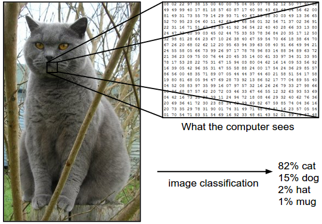
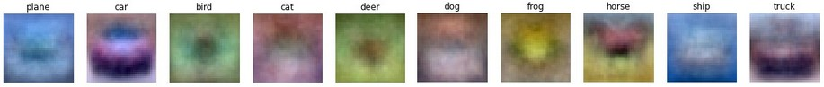

# Теория игр

Задача классификации
$$ \mathbf{x} \in \mathbb{R}^d \to y \in \{1,2, \dots, K\} $$

Обучающий набор данных (датасет)

$ \{ (\mathbf{x}_n, y_n)\}_{n=1,N}$

#### Линейный классификатор
$ f(x; W, b) = f_{W,b}(x) = Wx+b $

$ W \in \mathbb{R}^{d \times K}, b \in \mathbb{R}^k$ -  параметры (веса)

Интерпретация
1. score (оценка)

Эти оценки интерпретируются как ненормализованные логарифмы от вероятности для каждого класса
$$ \mathbb{P}(y=k \mid x; W) = \text{softmax}_k(f) = \frac{e^{f_k}}{\sum_j e^{f_j} } $$
$$ f(x)_k = \text{log} \mathbb{P}(y=k \mid x; W) + \text{log}(\sum_j e^{f_j} )$$

2. Как соспоставление шаблонов

Каждая строка $W$ соответствует шаблону (или иногда также называемому прототипом) для одного из классов. 

#### Функция потерь

Кросс-энтропия $ H(p,q) = - \sum_x p(x) \log q(x) $

Истинное распределение   $p = \begin{pmatrix} 0 \\ \dots \\0 \\  1 \\ 0 \\ \dots \\ 0 \end{pmatrix}$, где $p_{y_i}=1$

Функция потерь $ l(x_i, y_i, W) = - \log \mathbb{P}(y=y_i \mid x_i; W) $

#### Градиентный спуск

