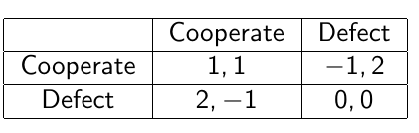
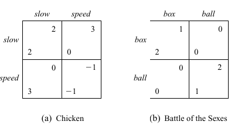
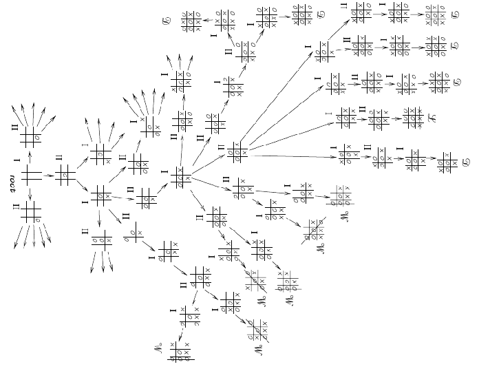
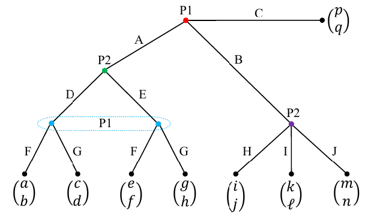
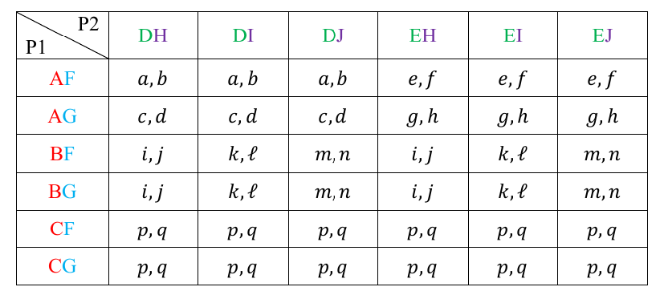

# **Теория игр**
 Введение

2025

---

#### Нормальная форма игры

1. Конечное множество из $N$ игроков.
2. Множество действий для игроков: $\{\mathcal{A}_1, \mathcal{A}_2, \dots \mathcal{A}_N\}$
3. Функции выигрыша для $n$-го игрока: $R_n : \mathcal{A}_1 \times \mathcal{A}_2 \dots \times \mathcal{A}_N \to \mathbb{R}$
   (может быть представлено в виде матрицы, два игрока -> две матрицы)

   $$R_n(a_1, ..,a_{n-1}, a_n,a_{n+1}, .. ,a_N)=R_n(a_n, a_{-n})$$
   где $a_{-n} = (a_1, ..,a_{n-1}, a_{n+1}, .. ,a_N)$

-----
#### Примеры

**Пример** Дилемма заключённого

Выигрыш тесно связан с предпочтениями

$$a'_n \preccurlyeq a_n \Leftrightarrow R_n(a'_n, a_{-n}) \leq R_n(a_n, a_{-n})$$

-----
#### Примеры

-----
#### Примеры

**Пример** Игра в орлянку

**Пример** Охота на оленя

**Пример** Игра "Камень-ножницы-бумага"

-----
#### Концепции решения

<ins>Слабое доминирование</ins>

<ins>Сильное доминирование</ins>

  
------

#### Слабое доминирование

Действие $a_n$ **слабо доминирует** действие $a'_n$ для игрока $n$, если для всех возможных комбинаций действий остальных игроков $a_{-n} \in \mathcal{A}_{-n}$ выполняется: 
$
R_n(a_n, a_{-n}) \geq R_n(a'_n, a_{-n}),
$

причём существует хотя бы одна комбинация действий $a_{-n}$, для которой выполняется строгое неравенство:
$
R_n(a_n, a_{-n}) > R_n(a'_n, a_{-n}).
$

Иными словами, действие $a_n$ приносит игроку $n$ не меньший выигрыш, чем действие $a'_n$, при любых действиях остальных игроков, и хотя бы в одном случае строго больший выигрыш.

-------

#### Концепции решения

 <ins>Функция наилучшего ответа</ins> - многозначная функция 
$B_n(a_{-n})=\underset{a_n}{\arg \max} R_n(a_n, a_{-n})$

<ins> Равновесие Нэша</ins>
набор стратегий в игре для двух и более игроков, в котором ни один участник не может увеличить выигрыш, изменив свою стратегию, если другие участники своих стратегий не меняю
$$\forall n R_n(a_n^*, a_{-n}^*) \geq R_n(a_n, a_{-n}^*)$$

-----
#### Концепции решения

Выбор равновесия Нэша

<ins>Оптимальность по Парето</ins>

-----
#### Развёрнутая форма игры

-----
#### Примеры
Следующие две игры в развёрнутой форме представляют
одновременную игру в орлянку. Петли представляют информационные множества игроков, которые ходят на этом этапе. Это игры с несовершенной информацией. Эти игры представляют одну и ту же стратегическую ситуацию: каждый игрок выбирает своё действие, не зная выбора оппонента.

-----
#### Получение нормальной формы из развёрнутой формы игры

Каждая игра в развёрнутой форме имеет уникальное представление в нормальной форме

-----

#### Развёрнутая форма игры

<ins>Чистая стратегия игрока</ins> - это набор отображений
из всех возможных историй в доступные действия

$I(x)$ - информационное множество (обобщение идеи истории) - что игрок знает, когда выбирает своё действие

$x' \in I(x)$ означает, что $x'$ неотличимо от $x$ 

$V_G$ - множество узлов $G$

$H$ - истории

-----
#### Решение

<ins>Подграф $G'$ (игры в развёрнутой форме G)</ins> - это один узел $G$ и его потомки с условием: если $x_1 \in V_{G'}$ и $x_2 \in I(x_1)$, то $x_2 \in V_{G'}$ (Если узел в определённом информационном множестве находится в подграфе, то все члены этого информационного множества принадлежат подграфу.)

$H|_{G'} =\{ h'=(a^t, \dots , a^T):(h,h')=(a^1, \dots , a^T) \in H\}$

<ins>Совершенное равновесие Нэша в подграфах (SPE) в игре $G$</ins>
Профиль стратегий $s^*$ такой, что для любого подграфа $G'$ игры $G$,
$s^*|_{G'}$ (профиль действий, подразумеваемый $s$ в подграфе $G'$) является равновесием Нэша в $G'$.

----
#### Обратная индукция

**Обратная индукция** заключается в том, чтобы начинать с последних подграфов конечной игры, затем находить профили стратегий наилучшего ответа или равновесия Нэша в подграфах, затем назначать эти профили стратегий и связанные с ними выигрыши подграфам и последовательно двигаться к началу игры.

Доказательство основано на **Принципе отклонения на одном этапе**
Неформально, $s$ является совершенным равновесием Нэша (SPE), если и только если ни один игрок $i$ не может выиграть, отклоняясь от $s$ на одном этапе и следуя $s$ в дальнейшем.

----
#### Повторяющиеся игры $T < \infty$

Выигрыш на этапе для игрока $n$
$$ r_n: A \to \mathbb{R}$$ 

$$R_n = \sum_t \gamma^{t} \cdot r_n(a^t_i, a^t_{-i})  $$

**Теорема**  
Для $T < \infty$ единственное SPE $\pi^* = a^*$ для единственного чистого равновесия на одном этапе $a^*$

----
#### Пример

1. В последнем периоде "предательство" является доминирующей стратегией независимо от истории игры. Таким образом, подграф, начинающийся на $T$, имеет равновесие в доминирующих стратегиях: $( D, D )$.
2. Затем переходим к этапу $T − 1$. По обратной индукции мы знаем, что на $T$, независимо от того, что произошло, будет играться $(D, D )$. Тогда, учитывая это, подграф, начинающийся на $T − 1$ (опять же независимо от истории), также имеет равновесие в доминирующих стратегиях.
3. С этим аргументом мы получаем, что существует единственное SPE: $(D, D )$ на каждом этапе.

----
#### Повторяющиеся игры $T=\infty$

$$R =(1-\gamma) \sum_t \gamma^{t} \cdot r(a^t_i, a^t_{-i})  $$

<ins> Стратегия триггера</ins>
Стратегия триггера по сути угрожает другим игрокам "худшим", наказанием, действием, если они отклоняются от неявно согласованного профиля действий.

------
#### Пример. Бесконечно повторяющаяся дилемма заключённого

1. SPE - использовать действие $C$, если кто-то не использует в первый раз $D$. В этом случае также использовать $D$.
2. С момента $t$ использовать действие $C$
$R = (1-\gamma)(1 + \gamma + \gamma^2 + \dots) = 1$
3. С момента $t$ отклоняться и использовать действие $D$
$R = (1-\gamma)(2 + 0 + 0 + \dots) = 2 \cdot (1 - \gamma)$
4. Сотрудничество лучше, если $2 \cdot (1 - \gamma) \geq 1$

**Теорема Фолкса**