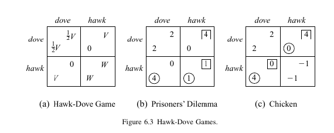
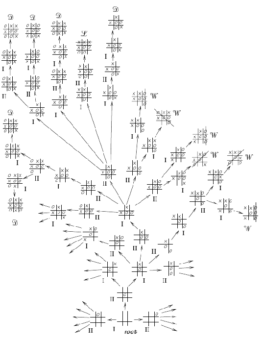
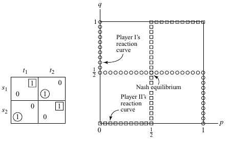
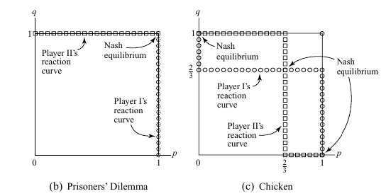
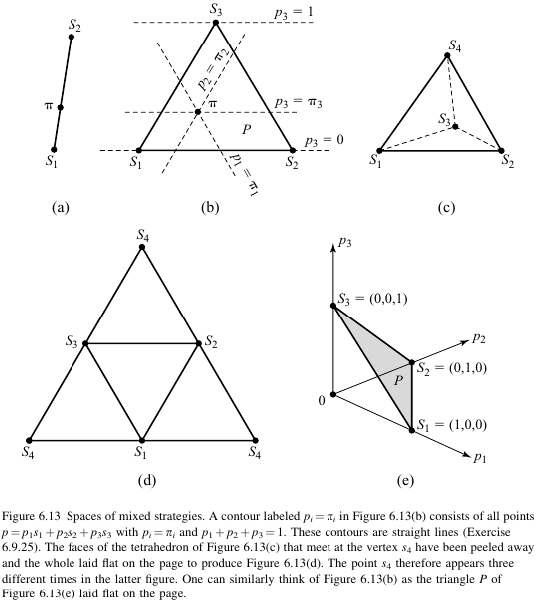
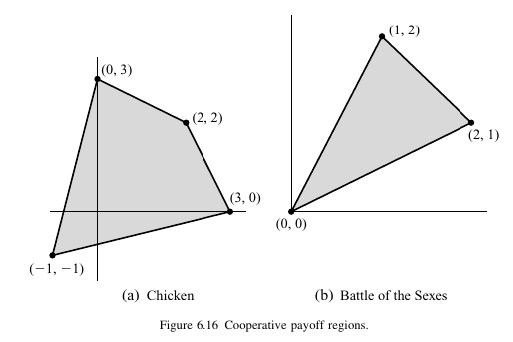
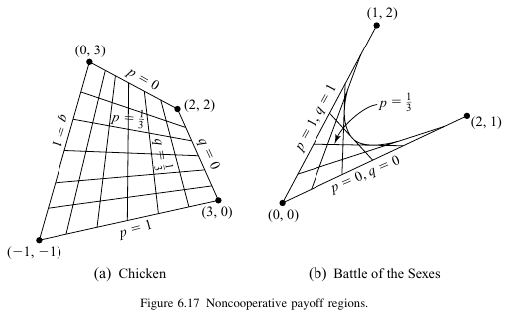
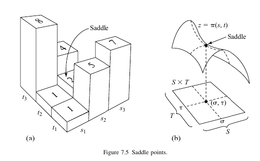
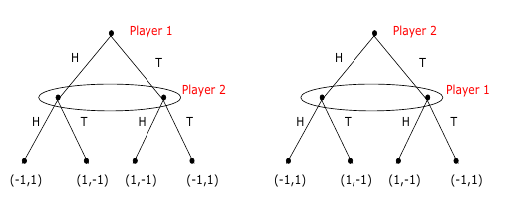

<ins>Normal-form game (game in strategic form) (Нормальная форма игры) </ins>
1. A finite set of $N$ players.
2. Action set for the players: $\{\mathcal{A}_1, \mathcal{A}_2, \dots \mathcal{A}_N\}$
3. Reward functions for the k player: $R_n : \mathcal{A}_1 \times \mathcal{A}_2 \dots \times \mathcal{A}_N \to \mathbb{R}$
   (can be represented as matrix, two players -> two matrices bn )

**Types of games**

**example**  the Prisoner’s Dilemma

*Reward is closely related to preference*

$$a_1 \preccurlyeq a_2 \Leftrightarrow u(a_1) \leq u(a_2)$$

**example**

**example**

**example**
Rock-scisor-paper game

**example** Hawk-dove games

<ins>Extensive form games (Развёрнутая форма игры)</ins>

#### Deriving Normal Form from Extensive Form Games

every extensive form game has a unique normal form
representation

->

### Mixed strategies

$$\pi=(\pi_1,..\pi_i..,\pi_N)=(\pi_i,\pi_{-i})$$

Expected return for mixed strategies (utility) $$ J_n(\pi) = \mathbb{E}_\pi[R_n]=\sum_{(a_1,..,a_N) \in A_1 \times ... \times A_N}\pi_1(a_1)\cdot...\cdot\pi_n(a_n) \cdot R_n(a_1, ..., a_N) = \sum_{a_n \in A_n }  \pi_1(a_n) \Bigg[ \sum_{a_{-n} \in A_{-n} }  \pi_n(a_{-n}) \cdot R_n(a_n, a_{-n}) \Bigg] = < \Big(\sum_{a_n \in A_n }  \pi_1(a_n) \Big)_{a_n \in A_n } , \Big( \sum_{a_{-n} \in A_{-n} }  \pi_n(a_{-n}) \cdot R_n(a_n, a_{-n}) \Big)_{a_n \in A_n } > $$

*For two players game reward vector will be equal* $R_k((\pi_1, \pi_2)) = \pi_1R_k\pi_2$

<ins>reaction curve</ins>

Spaces of mixed strategies

<ins>Payoff regions</ins>

cooperative payoff regions: 
$\pi(a_n, a_{-n})$ не факторизуемая

$ J_n(\pi) = \mathbb{E}_\pi[R_n]=\sum_{(a_1,..,a_N) \in A_1 \times ... \times A_N}\pi(a_1, ..., a_N) \cdot R_n(a_1, ..., a_N)$ для $\forall  \pi(a_1, ..., a_N)$ , следовательно  convex function

noncooperative payoff regions:

### Solution concepts

<ins> Nash equilibrium</ins>

$$\forall n R_n(\pi_n^*, \pi_{-n}^*) \geq R(\pi_n, \pi_{-n}^*)$$

 <ins>Best responce function</ins> 

set-valued function 

for  mixed strategies $B_n(\pi_{-n})=\underset{\pi_n}{\arg \max} J_n(\pi_n, \pi_{-n})$

**Nash equlibrium in zero sum game = minimax (maximin)**

**a player has a profitable deviation if and only if they have a profitable deviation to a pure strategy** can be established through the following proof.

▎Definitions

1. Mixed Strategy: A strategy where a player randomizes over two or more pure strategies.

2. Pure Strategy: A strategy where a player chooses one specific action with certainty.

3. Payoff: The outcome a player receives from a particular strategy profile.

▎Proof

▎1. If a player has a profitable deviation to a mixed strategy, then they have a profitable deviation to a pure strategy.

Assume player  i  is currently playing a mixed strategy  σᵢ  in a game where the other players are playing strategies  σ₋ᵢ . 

Let  uᵢ(σᵢ, σ₋ᵢ)  denote the payoff to player  i  when playing strategy  σᵢ  against the strategies of the other players  σ₋ᵢ .

If player  i  has a profitable deviation to another mixed strategy  σ'ᵢ , this means:

uᵢ(σ'ᵢ, σ₋ᵢ) > uᵢ(σᵢ, σ₋ᵢ)

Now, because mixed strategies are composed of probabilities over pure strategies, there exists at least one pure strategy  sᵢ  such that:

uᵢ(sᵢ, σ₋ᵢ) > uᵢ(σᵢ, σ₋ᵢ)

This is due to the fact that if the mixed strategy  σ'ᵢ  is better than  σᵢ , then at least one of the pure strategies in  σ'ᵢ  must yield a higher payoff against  σ₋ᵢ  than  σᵢ . Thus, we conclude that player  i  has a profitable deviation to some pure strategy.

▎2. If a player has a profitable deviation to a pure strategy, then they have a profitable deviation to a mixed strategy.

Conversely, suppose player  i  can deviate to a pure strategy  sᵢ'  such that:

uᵢ(sᵢ', σ₋ᵢ) > uᵢ(σᵢ, σ₋ᵢ)

Now, consider the mixed strategy  σ'ᵢ  that assigns probability 1 to playing  sᵢ'  (and probability 0 to all other strategies). Then:

uᵢ(σ'ᵢ, σ₋ᵢ) = uᵢ(sᵢ', σ₋ᵢ) > uᵢ(σᵢ, σ₋ᵢ)

Thus, this mixed strategy  σ'ᵢ  represents a profitable deviation as well.

**proof**

define $ \varphi_{n,a_n} (\pi=\pi_n,\pi_{-n}) = \max \{ 0, J_n(a_n, \pi_{-n})\}$

it is one of the best responces regarding action $a_n$ because  a player has a profitable deviation if and only if he has a profitable
deviation to a pure strategy

define $f: \Pi=\Pi_1 \times \dots \times \Pi_N \to \Pi$

$$ f_{n,a_n} (\pi) = \frac{\pi_n(a_n) + \varphi_{n, a_n}(\pi) }{\sum_{b_n \in A_N}\Big[ \pi_{n}(b_n) + \varphi_{n,b_n}(\pi) \Big]}$$

$f$ is continuous (each $\varphi_{n,an}$ is continuous)

$\Pi$ is compact (each $\Pi_n$ is compact)

Then by Brouwer’s fixed point theorem f has at least one fix point

$\Rightarrow$ If $\pi$ is Nash eq, then $\forall n \forall a_n\varphi_{n,an}=0$, then $\pi$ is fixed point

$\Leftarrow$ $\exists a_n \in support(n)=\{a > 0\}$ such that $R_n(a_n, \pi_{-n}) \leq R_n(\pi_n, \pi_{_n})$ by linearity of expectaion

Then $\varphi_{n,an}=0$  (*)

 $f(\pi)_{n, a_n} = \pi_{n,a_n}$ (**) because $\pi$ is fixed point

(*), (**) $\Rightarrow \sum_{b_n \in A_N}\Big[ \pi_{n}(b_n) + \varphi_{n,b_n}(\pi) \Big]=1 \Rightarrow \forall b_n \varphi_{n,b_n}=0$ beacause    $\varphi_{n,b_n} \geq 0$ 

then no player can improve his expected
payoff by moving to a pure strategy 

then $\pi$ is a Nash equilibrium

<ins>Weak domination</ins>

<ins>$\epsilon$-Nash equlibrium </ins>

<ins>Pareto optimality</ins>

treat \pi as vector indexed by players

### Extensive game. Repeated games

<ins>a pure strategy of a player </ins> is a collection of maps
from all possible histories into available action

$h(x)$ - information set (generalization of idea of history) - waht player has when he is choosing his action

**example**

The following two extensive form games are representations of the
simultaneous-move matching pennies.
The loops represent the information sets of the players who move at that
stage. These are imperfect information games.
These games represent exactly the same strategic situation: each player
chooses his action not knowing the choice of his opponent.

$x' \in h(x)$ means $x'$ is indistinguishable from $x$ 

$V_G$ - set of nodes of $G$

<ins>subgame $G'$ (of an extensive game G)</ins>
a single nnode of the $G$ and its sucessors with property: 
$x_1 \in V_{G'}$ and $x_2 \in h(x_1)$, then $x_2 \in V_{G'}$ (If a node in a particular information set is in the subgame then all members of that information set belong to the subgame.)

<ins>subgame perfect nash equlibrium (SPE) in game $G$</ins>
A strategy profile $s^*$ s.t.
for any subgame $G'$ of $G$ ,
$s^*|_{G'}$ (action profile implied by $s$ in the  subgame $G'$) is a Nash equilibrium of $G$ .

**Backward induction** refers to starting from the last subgames of a
finite game, then finding the best response strategy profiles or the
Nash equilibria in the subgames, then assigning these strategies
profiles and the associated payoffs to be subgames, and moving
successively towards the beginning of the game.

proof based on

**One-stage Deviation Principle**^ 
Informally, s is a subgame perfect equilibrium (SPE) if and only if no player i
can gain by deviating from s in a single stage and conforming to s thereafter.

### Learning solution in game

1. Ficticious play (store as memory opponents moves statistic)

2. the study
of evolutionary models: the replicator dynamic and the idea of an Evolutionary Stable
Strategy or ESS. S

### Sources
1. MULTI-AGENT REINFORCEMENT LE ARNING FOUNDATIONS AND MODERN APPROACHE S Stefano V. Albrecht
2. An Introduction to Game Theory by
Martin J. Osborne
3. https://nashpy.readthedocs.io/en/stable/text-book
4. An overview of Multi-agent reinforcement learning from Game theoretic persspective
5. A Tutorial on the Proof of
the Existence of Nash Equilibria
Albert Xin Jiang Kevin Leyton-Brown
6. Playing for real? Ken Binmore