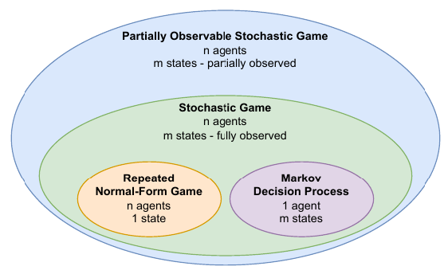
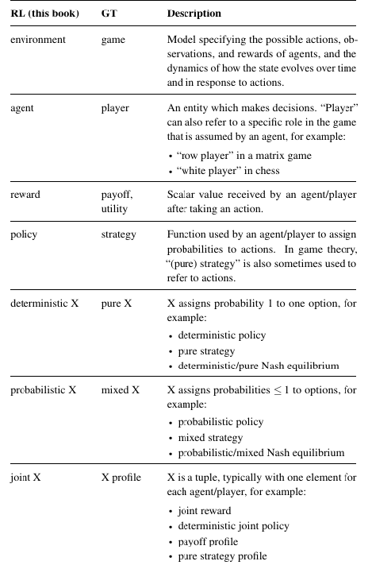
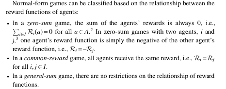
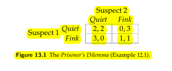
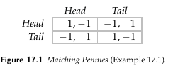
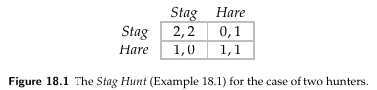
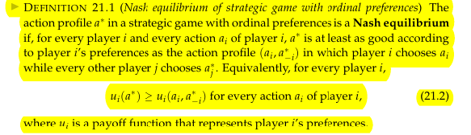
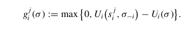
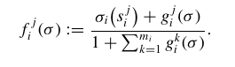
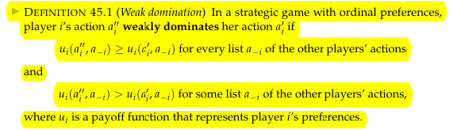

<ins>Normal-form game (game in strategic form) </ins>
1. A finite set of $N$ players.
2. Action set for the players: $\{\mathcal{A}_1, \mathcal{A}_2, \dots \mathcal{A}_N\}$
3. Reward functions for the k player: $R_n : \mathcal{A}_1 \times \mathcal{A}_2 \dots \times \mathcal{A}_N \to \mathbb{R}$
   (can be represented as matrix, two players -> two matrices bn )

**Types of games**

**example**  the Prisoner’s Dilemma

*Reward is closely related to preference*

**example**

**example**

**example**
Rock-scisor-paper game

### Mixed strategies

$$\pi=(\pi_1,..\pi_i..,\pi_N)=(\pi_i,\pi_{-i})$$

Expected return for mixed strategies (utility) $$ J_n(\pi) = \mathbb{E}_\pi[R_n]=\sum_{(a_1,..,a_N) \in A_1 \times ... \times A_N}\pi_1(a_1)\cdot...\cdot\pi_n(a_n) \cdot R_n(a_1, ..., a_N) $$

*For two players game reward vector will be equal* $R_k((\pi_1, \pi_2)) = \pi_1R_k\pi_2$

### Solution concepts

<ins> Nash equilibrium</ins>

$$\forall n R_n(\pi_n^*, \pi_{-n}^*) \geq R(\pi_n, \pi_{-n}^*)$$

**proof**

function f

 <ins>Best responce function</ins> 

set-valued function 

for  mixed strategies $B_n(\pi_{-n})=\underset{\pi_n}{\arg \max} J_n(\pi_n, \pi_{-n})$

<ins>Weak domination<\ins>

<ins>$\epsilon$-Nash equlibrium <\ins>

### Learning solution in game

Ficticious play (store as memory opponents moves statistic)

### Sources
1. MULTI-AGENT REINFORCEMENT LE ARNING FOUNDATIONS AND MODERN APPROACHE S Stefano V. Albrecht
2. An Introduction to Game Theory by
Martin J. Osborne
3. https://nashpy.readthedocs.io/en/stable/text-book
4. An overview of Multi-agent reinforcement learning from Game theoretic persspective