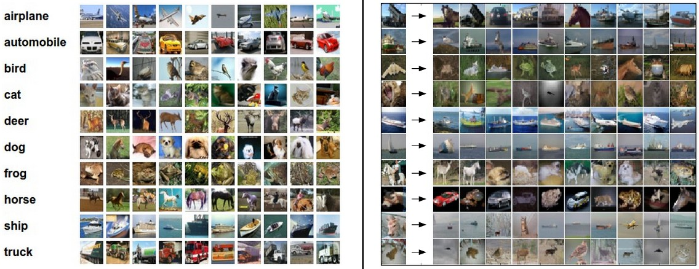
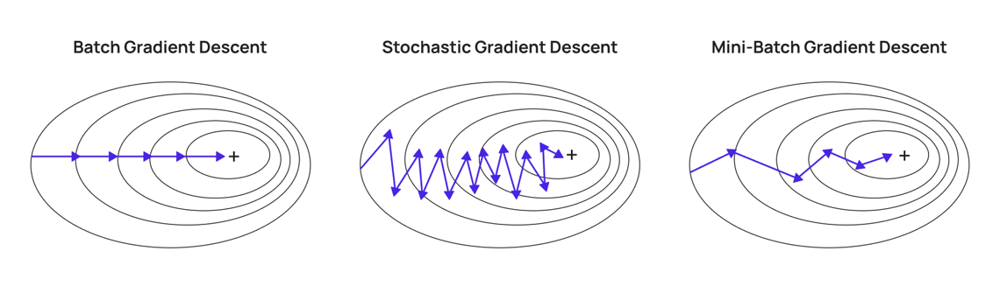

# Градиентный спуск в задачах классификации
## От линейных оценок до оптимизации
---

# Задача классификации

Пусть дано признаковое описание объекта $\mathbf{x} \in \mathbb{R}^d$.
Задача состоит в отображении объекта в один из $K$ классов:

$$ \mathbf{x} \in \mathbb{R}^d \to y \in \{1,2, \dots, K\} $$

---

# Обучающий набор данных (датасет)

$$ \mathcal{D} = \{ (\mathbf{x}_n, y_n)\}_{n=1}^N $$
где $N$ — количество объектов.

---

# Задача классификации

Пусть дано признаковое описание объекта $\mathbf{x} \in \mathbb{R}^d$.
Задача состоит в отображении объекта в один из $K$ классов:

$$ \mathbf{x} \in \mathbb{R}^d \to y \in \{1,2, \dots, K\} $$

**Обучающий набор данных (датасет):**

---

# Линейный классификатор

Линейная модель вычисляет **скор (score)** для каждого класса:
$$ f(x; W, b) = W\mathbf{x} + \mathbf{b} $$

где:
- $W \in \mathbb{R}^{K \times d}$ — матрица весов (каждая строка соответствует классу).
- $\mathbf{b} \in \mathbb{R}^K$ — вектор смещения (bias).

---

# Линейный классификатор. Интерпетация 1

**Сопоставление с шаблонами**

Каждая строка $W_k$ — это "шаблон" (прототип) $k$-го класса.

---

# Линейный классификатор. Интерпетация 2

**Score (оценка)**

Скор $f_k$ — это степень сходства входа $\mathbf{x}$ с шаблоном класса $k$ (скалярное произведение).

---

# От скоров к вероятностям: Softmax

Линейные скоры $f_k$ могут принимать любые значения: $(-\infty, +\infty)$.
Нам же нужны вероятности $P(y=k|\mathbf{x})$, удовлетворяющие условиям:
1. $P \in [0, 1]$
2. $\sum_{k=1}^K P_k = 1$

**Решение: Функция Softmax**

Мы используем экспоненту для перевода области определения в $(0, +\infty)$:
$$ \text{softmax}_k(f) = \frac{e^{f_k}}{\sum_{j=1}^K e^{f_j}} $$

1. **Положительность:** $e^{f_k} > 0$ всегда.
2. **Нормировка:** Деление на сумму дает вероятность.
3. **Интерпретация:** Скоры $f_k$ часто называют **логитами** (logits) или ненормализованными логарифмами вероятностей.****

---

# Связь логитов и вероятностей

Из формулы Softmax можно выразить логит через вероятность:
$$ P(y=k \mid x) = \frac{e^{f_k}}{\sum_j e^{f_j}} $$

Взяв натуральный логарифм от вероятности:
$$ \log P(y=k \mid x) = f_k - \log \sum_j e^{f_j} $$

Таким образом, линейный скор $f_k$ равен логарифму вероятности с точностью до константы (log-sum-exp), которая не зависит от класса $k$, а зависит от общего "уровня уверенности" модели.

---

# Принцип максимального правдоподобия (MLE)

Мы хотим найти такие параметры $W$, при которых наблюдаемые данные наиболее вероятны.

**Правдоподобие (Likelihood):**
Вероятность того, что модель с параметрами $W$ сгенерирует наш датасет $\mathcal{D}$ (при условии независимости примеров):
$$ \mathcal{L}(W) = \prod_{n=1}^N P(y_n \mid \mathbf{x}_n; W) $$

**Log-Likelihood (логарифм правдоподобия):**
Удобнее работать с логарифмом (произведение превращается в сумму):
$$ \ell(W) = \sum_{n=1}^N \log P(y_n \mid \mathbf{x}_n; W) $$

Задача обучения: **максимизировать** $\ell(W)$.

---

# Кросс-энтропия как функция потерь

В машинном обучении мы привыкли **минимизировать** потери, а не максимизировать правдоподобие.

Введем **Функцию потерь (Loss function)** для одного примера $(x_i, y_i)$:
$$ L_i = - \log P(y=y_i \mid \mathbf{x}_i; W) $$

Это **отрицательный логарифм правдоподобия (Negative Log-Likelihood, NLL)**.

Тогда максимизация правдоподобия эквивалентна минимизации средней кросс-энтропии по всему датасету:
$$ \mathcal{J}(W) = \frac{1}{N} \sum_{i=1}^N L_i = - \frac{1}{N} \sum_{i=1}^N \log P(y_i \mid \mathbf{x}_i; W) $$

**Вывод:** Минимизация кросс-энтропии $\iff$ Максимизация правдоподобия данных.

---

# Градиент: Определение

Чтобы минимизировать функцию потерь $\mathcal{J}(W)$, нужно знать направление наискорейшего роста функции.

**Градиент** функции скалярного поля $\mathcal{J}(\mathbf{w})$ — это вектор частных производных:
$$ \nabla \mathcal{J}(\mathbf{w}) = \begin{pmatrix} \frac{\partial \mathcal{J}}{\partial w_1} \\ \frac{\partial \mathcal{J}}{\partial w_2} \\ \vdots \\ \frac{\partial \mathcal{J}}{\partial w_d} \end{pmatrix} $$

Свойства:
1. Указывает направление наискорейшего возрастания функции.
2. Антиградиент $-\nabla \mathcal{J}$ указывает направление наискорейшего убывания.
3. Перпендикулярен линиям уровня (изоповерхностям).

---

# Градиент: Пример

Пусть функция потерь (для упрощения, для одного веса $w$) выглядит как:
$$ \mathcal{J}(w) = (w - 3)^2 $$

Градиент (в данном случае просто производная):
$$ \frac{d\mathcal{J}}{dw} = 2(w - 3) $$

Пусть текущее значение $w_0 = 0$.
Градиент: $\nabla \mathcal{J}(0) = 2(0 - 3) = -6$.

Это значит:
- Функция растет в направлении $-6$ (влево).
- Функция убывает в направлении $+6$ (вправо, к минимуму в точке 3).
- Мы должны двигаться в сторону антиградиента: $w_{new} = w_{old} - \eta \nabla \mathcal{J}$.

---

# Градиентный спуск

Нахождение локального минимуму функции $\mathcal{J}: \mathbb{R}^n \to \mathbb{R}$

0. Инициализация $\mathbf{w}^0$ произвольно

1. Для каждой итерации выбор шага обновления $\eta$,
 где $\eta > 0$ — скорость обучения (learning rate).
$$ \mathbf{w}^{k+1} \leftarrow \mathbf{w_k}-\eta\nabla \mathcal{J}(\mathbf{w_k}) $$
2. Повторение шага 1

Для минимума $w^*$ верно $\nabla \mathcal{J}(\mathbf{w}^*)=0$

---

# Градиентный спуск

---

# Обоснование градиентного спуска (Ряд Тейлора)

Почему движение в сторону антиградиента уменьшает функцию?

Рассмотрим разложение функции $\mathcal{J}(\mathbf{w})$ в ряд Тейлора в окрестности точки $\mathbf{w}_t$ (первый порядок малости):
$$ \mathcal{J}(\mathbf{w}_{t+1}) \approx \mathcal{J}(\mathbf{w}_t) + \nabla \mathcal{J}(\mathbf{w}_t)^T (\mathbf{w}_{t+1} - \mathbf{w}_t) $$

Сделаем шаг градиентного спуска:
$$ \mathbf{w}_{t+1} = \mathbf{w}_t - \eta \nabla \mathcal{J}(\mathbf{w}_t) $$

Подставим шаг в разложение:
$$ \mathcal{J}(\mathbf{w}_{t+1}) \approx \mathcal{J}(\mathbf{w}_t) - \eta \underbrace{\nabla \mathcal{J}(\mathbf{w}_t)^T \nabla \mathcal{J}(\mathbf{w}_t)}_{\|\nabla \mathcal{J}\|^2 \ge 0} $$

Так как $\|\nabla \mathcal{J}\|^2 \ge 0$, то $\mathcal{J}(\mathbf{w}_{t+1}) \le \mathcal{J}(\mathbf{w}_t)$.
**Вывод:** При достаточно малом $\eta$ значение функции гарантированно уменьшается.

---

# Варианты градиентного спуска

Вычислять градиент по всей базе данных дорого. Существуют три подхода:

### 1. Batch Gradient Descent (Пакетный)
Градиент считается по **всем** $N$ примерам:
$$ \mathbf{w}_{t+1} = \mathbf{w}_t - \eta \frac{1}{N} \sum_{i=1}^N \nabla L_i $$
- **Плюс:** Точное направление спуска, гарантия сходимости к локальному минимуму (для выпуклых функций).
- **Минус:** Очень медленно на больших данных, требует много памяти.

---

# Варианты градиентного спуска

### 2. Stochastic Gradient Descent (SGD, Стохастический)
Градиент считается по **одному** случайному примеру $i$:
$$ \mathbf{w}_{t+1} = \mathbf{w}_t - \eta \nabla L_i $$
- **Плюс:** Очень быстро, позволяет выходить из локальных минимумов из-за шума.
- **Минус:** "Дрожащая" траектория сходимости, сложность распараллеливания.

---

# Mini-batch Gradient Descent

Золотая середина (стандарт в глубоком обучении):
Градиент считается по **небольшой подвыборке** (batch) размера $B$ (обычно 32, 64, 128):
$$ \mathbf{w}_{t+1} = \mathbf{w}_t - \eta \frac{1}{B} \sum_{j \in \text{batch}} \nabla L_j $$

- **Плюсы:** 
  - Стабильнее SGD за счет усреднения шума.
  - Быстрее Batch GD, так как не нужно прогонять всю базу.
  - Отлично распараллеливается на GPU.

---

# Варианты градиентного спуска

---

# Понятие Эпохи (Epoch)

При использовании Mini-batch GD или SGD мы не проходим по всей базе за один шаг обновления весов.

**Эпоха** — это один полный проход по всему обучающему датасету.

**Пример:**
- Размер датасета $N = 10,000$.
- Размер батча $B = 100$.
- **Итерация:** одно обновление весов (обработка одного батча).
- Количество итераций в одной эпохе: $N / B = 10,000 / 100 = 100$.

Обучение обычно длится несколько десятков или сотен эпох.

---

# Итог

1. **Линейная модель** выдает скоры $f = Wx+b$.
2. **Softmax** переводит скоры в вероятности, сохраняя порядок и дифференцируемость.
3. **Кросс-энтропия** — функция потерь, минимизация которой эквивалентна максимизации правдоподобия (MLE).
4. **Градиент** показывает направление наискорейшего роста.
5. **Градиентный спуск** обоснован разложением в ряд Тейлора: шаг в сторону антиградиента уменьшает функцию потерь.
6. На практике используется **Mini-batch SGD**, а одной **эпохой** считается проход по всей выборке.
