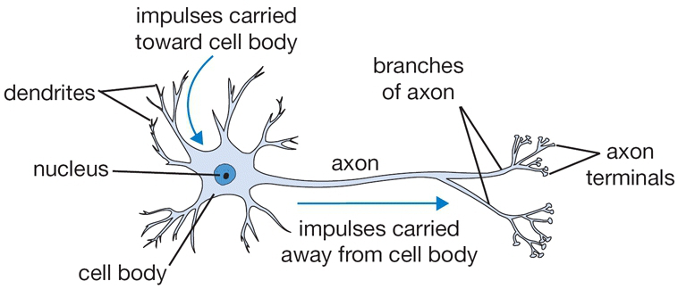
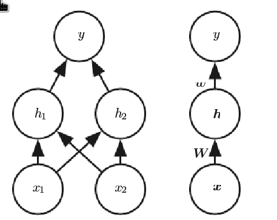
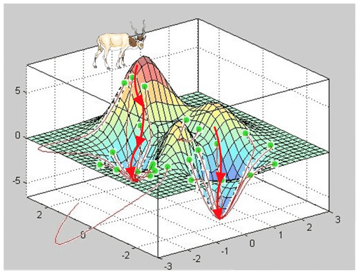
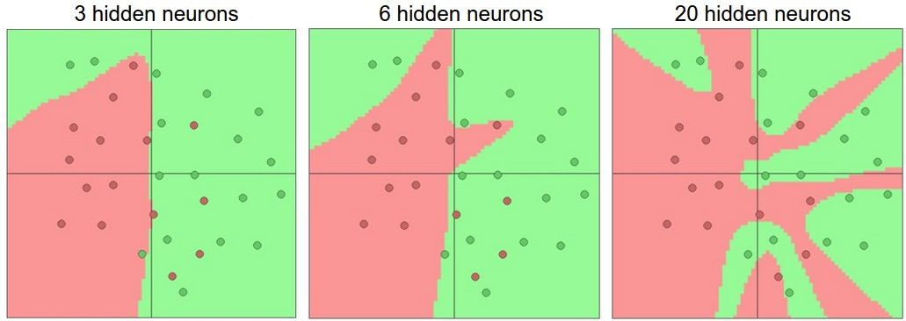
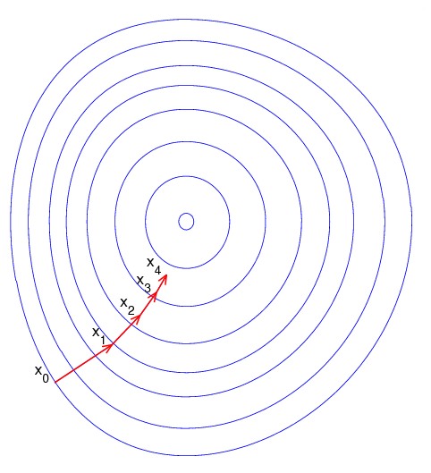
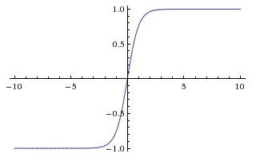
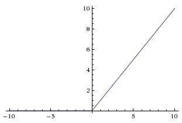
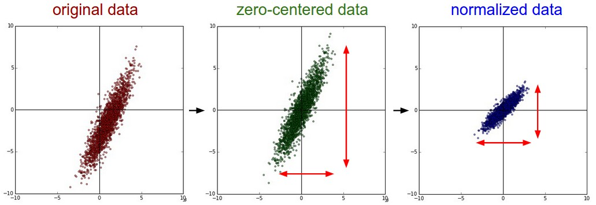
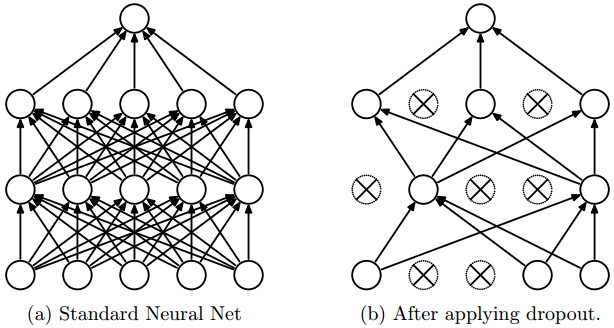
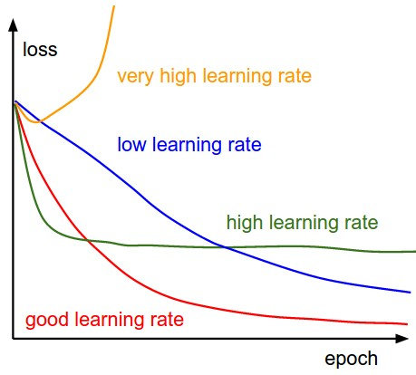

# Нейронные сети: от теории к практике

*Материалы курса CS231n: Neural Networks*

---

## 📋 План презентации

1. Введение: что такое нейронная сеть?
2. Модель одного нейрона
3. Функции активации
4. Архитектура нейронных сетей
5. Прямое распространение (Forward Pass)
6. Предобработка данных
7. Инициализация весов
8. Регуляризация
9. Оптимизация и обучение
10. Практические рекомендации

---

### Линейный классификатор:
$$s = Wx$$
- `x` — входной вектор (например, [3072×1] для CIFAR-10)
- `W` — матрица весов [10×3072]
- `s` — вектор оценок классов [10×1]

### Нейронная сеть (2 слоя):
$$s = W₂ · \text{softmax}(W₁x)$$
- `W₁`: [100×3072] → промежуточный вектор [100×1]
- `softmax(0,·)` — нелинейность
- `W₂`: [10×100] → выходные оценки [10×1]

> **Ключевая идея**: нелинейность позволяет моделировать сложные зависимости!

---
## Модель одного нейрона


```
┌─────────────────┐
│  Биологический  │     
│    нейрон       │     
│  • Дендриты →   │     
│  • Тело клетки  │     
│  • Аксон →      │
└─────────────────┘
```

---

## Модель одного нейрона

### Биологическая мотивация:
Математическая модель: 
$z = \sum_i (wᵢ·xᵢ) + b$
$a = f(z)$  ← функция активации

### Вычисление нейрона (код):
```python
class Neuron:
    def forward(self, inputs):
        # Скалярное произведение + смещение
        z = np.sum(inputs * self.weights) + self.bias
        # Функция активации (сигмоида)
        return 1.0 / (1.0 + np.exp(-z))
```

---
##  Архитектура нейронных сетей




---
## Архитектура нейронных сетей
Один слой - вектор нейронов
$W$ - матрица слоя, каждая строчка матрицы - веса одного нейрона




---

##  Архитектура нейронных сетей

### Полносвязные слои (Fully-Connected):
```
Вход [3×1] → [W₁:4×3] + b₁ → ReLU → [4×1]
           → [W₂:4×4] + b₂ → ReLU → [4×1]  
           → [W₃:1×4] + b₃ → Выход [1×1]
```

### Пример forward pass:
```python
f = lambda x: np.maximum(0, x)  # ReLU

h1 = f(W1 @ x + b1)  # Скрытый слой 1
h2 = f(W2 @ h1 + b2) # Скрытый слой 2
out = W3 @ h2 + b3   # Выход (без активации!)
```
---

##  Архитектура нейронных сетей

### Представительная способность:
> **Теорема универсальной аппроксимации**:  
> Сеть с ≥1 скрытым слоем может аппроксимировать любую непрерывную функцию с любой точностью.

> Но на практике глубокие сети работают лучше благодаря иерархическому представлению признаков!

---

## Прямое (forward) распространение: матричные операции

### Почему слои? Эффективность вычислений

```
Один слой = Матричное умножение + Смещение + Активация

          ┌─────────────┐
x ──────► │ W·x + b     │ ──────► f(·) ──────► h
[вход]    │ [линейная]  │         [нелинейность]  [активации]
          └─────────────┘
```

### Пакетная обработка (batch):
```python
# x: [D×N] — N примеров в столбцах
h1 = f(W1 @ X + b1)  # Все примеры параллельно!
```

___
##  Архитектура нейронных сетей




---
## Функции активации: сравнение

### 🔸 Sigmoid: σ(x) = 1/(1+e⁻ˣ)

```
• Диапазон: [0, 1]
• Насыщение → градиенты ≈ 0
• Выход не центрирован вокруг 0
• Редко используется в скрытых слоях
```
---

## Функции активации: сравнение

### 🔸 Tanh: tanh(x)

```
• Диапазон: [-1, 1] ✓
• ✓ Выход центрирован вокруг 0
• Всё ещё страдает от насыщения
•  Лучше сигмоиды, но уступает ReLU
```

---

## Функции активации: сравнение

### 🔸 ReLU: f(x) = max(0, x) 
```
• ✓ Быстрая вычислительно
• ✓ Ускоряет сходимость в 6× (по сравнению с tanh)
•  "Мёртвые нейроны" при высоком LR
•  Стандарт де-факто для скрытых слоёв
```

---

## Why a dead ReLU corresponds to a decision plane outside all input data

Consider a single ReLU neuron in a hidden layer of a neural network. Its output is:

$$
z = \mathbf{w}^T \mathbf{x} + b
$$
$$
a = \text{ReLU}(z) = \max(0, z)
$$

where $\mathbf{x} \in \mathbb{R}^d$ is the input vector (or the activation from the previous layer), $\mathbf{w}$ the weight vector, and $b$ the bias.

---

### The neuron's pre-activation hyperplane

The quantity $z = \mathbf{w}^T \mathbf{x} + b$ defines a **hyperplane** in the input space:

$$
\mathcal{H}: \mathbf{w}^T \mathbf{x} + b = 0
$$

This hyperplane splits the space into two half‑spaces:

- $\mathbf{w}^T \mathbf{x} + b > 0$ → neuron is active ($a > 0$)
- $\mathbf{w}^T \mathbf{x} + b < 0$ → neuron is off ($a = 0$)

---

### Condition for a dead ReLU

The neuron is **dead** if for **every** training sample $\mathbf{x} \in \mathcal{D}$ (and indeed for all realistic inputs) we have:

$$
\mathbf{w}^T \mathbf{x} + b < 0 \quad \Rightarrow \quad a = 0
$$

Equivalently, there exists some $\epsilon > 0$ (depending on the dataset) such that:

$$
\max_{\mathbf{x} \in \mathcal{D}} \left( \mathbf{w}^T \mathbf{x} + b \right) < 0
$$

---

### The hyperplane lies outside the data cloud

Let $\mathcal{C} = \text{conv}(\mathcal{D})$ be the convex hull of all inputs. Because every data point gives a negative pre‑activation, the hyperplane $\mathcal{H}$ does **not** intersect $\mathcal{C}$:

$$
\mathcal{H} \cap \mathcal{C} = \varnothing
$$

Geometrically, the hyperplane is placed **completely outside the region where the data lives**. All data points lie strictly on the negative side, and the hyperplane is somewhere far away in the direction of $-\mathbf{w}$.

---

### Why this is fatal for learning

For a dead neuron, the output is constant zero regardless of $\mathbf{x}$. The gradient of the loss $L$ with respect to the neuron’s parameters is:

$$
\frac{\partial L}{\partial \mathbf{w}} = \frac{\partial L}{\partial a} \cdot \frac{\partial a}{\partial z} \cdot \mathbf{x}, \qquad
\frac{\partial L}{\partial b} = \frac{\partial L}{\partial a} \cdot \frac{\partial a}{\partial z}
$$

But $\frac{\partial a}{\partial z} = 0$ when $z < 0$, so:

$$
\frac{\partial L}{\partial \mathbf{w}} = \mathbf{0}, \qquad \frac{\partial L}{\partial b} = 0
$$

The neuron receives **no error signal** – its weights and bias freeze forever. The hyperplane $\mathcal{H}$ remains permanently outside the data cloud, and the neuron contributes nothing to discriminating between classes.

---


### Intuitive takeaway

A dead ReLU neuron acts like a linear classifier whose decision boundary has been pushed so far away that **every input is classified as the negative side**. It is useless for the task and can never recover.

---

### Датасет:
$$
\mathcal{D} = \{(x_i, y_i)\}_{i=1}^N, \quad x_i \in \mathbb{R}^D, \quad y_i \in \{1, \dots, K\}
$$

### Архитектура сети (2 слоя для наглядности):
$$
\begin{aligned}
z_1 &= W_1 x + b_1 \quad &\text{[линейный слой 1]} \\
h &= \text{ReLU}(z_1) \quad &\text{[активация]} \\
z_2 &= W_2 h + b_2 \quad &\text{[линейный слой 2]} \\
s &= z_2 \quad &\text{[логиты, оценки классов]}
\end{aligned}
$$

### Цель:
$$
\min_{W_1, b_1, W_2, b_2} \mathcal{L} = \frac{1}{N} \sum_{i=1}^N \ell(s^{(i)}, y_i) + \lambda R(W)
$$

---

## Chain rule

Для скалярной функции композиции:
$$
\frac{d}{dx} f(g(x)) = f'(g(x)) \cdot g'(x)
$$

Для векторных функций (Якобианы):
$$
\frac{\partial \mathbf{u}}{\partial \mathbf{x}} = \frac{\partial \mathbf{u}}{\partial \mathbf{v}} \cdot \frac{\partial \mathbf{v}}{\partial \mathbf{x}}
$$

Ключевая идея backprop: **Градиент потери по параметру = произведение локальных градиентов по пути от выхода к параметру**

```
L ← s ← h ← z₁ ← W₁
    ↑    ↑    ↑    ↑
   ∂L/∂s ∂s/∂h ∂h/∂z₁ ∂z₁/∂W₁
```

---

## Прямой (forward) проход: детализация

### Для одного примера $(x, y)$:

```python
# Layer 1: Linear + ReLU
z1 = W1 @ x + b1                    # [H×1]
h = np.maximum(0, z1)               # [H×1], ReLU

# Layer 2: Linear → logits
s = W2 @ h + b2                     # [K×1]

# Softmax для вероятностей
exp_s = np.exp(s - np.max(s))       # численная стабильность
probs = exp_s / np.sum(exp_s)       # [K×1], Σ probs = 1
```
---

Матричная форма для батча $X \in \mathbb{R}^{D \times N}$:
$$
\begin{aligned}
Z_1 &= W_1 X + b_1 \mathbf{1}^T \\
H &= \max(0, Z_1) \\
S &= W_2 H + b_2 \mathbf{1}^T \\
P &= \text{softmax}(S)
\end{aligned}
$$

---

## Функция потерь: Negative Log-Likelihood

### Определение для одного примера:
$$
\ell(s, y) = -\log P(y|x) = -\log\left(\frac{e^{s_y}}{\sum_{k=1}^K e^{s_k}}\right)
$$

### Упрощение (log-sum-exp trick):
$$
\ell(s, y) = -s_y + \log\left(\sum_{k=1}^K e^{s_k}\right)
$$

---

## Функция потерь: Negative Log-Likelihood

### Для всего датасета с L2-регуляризацией:
$$
\boxed{
\mathcal{L} = \underbrace{-\frac{1}{N} \sum_{i=1}^N s^{(i)}_{y_i}}_{\text{кросс-энтропия}} + \underbrace{\frac{1}{N} \sum_{i=1}^N \log\left(\sum_{k} e^{s^{(i)}_k}\right)}_{\text{нормировка}} + \underbrace{\frac{\lambda}{2} \left(\|W_1\|_F^2 + \|W_2\|_F^2\right)}_{\text{регуляризация}}
}
$$

---

## Обратный проход: градиент по логитам $s$

### Вычисляем $\frac{\partial \ell}{\partial s_j}$ для всех $j \in \{1,\dots,K\}$:

$$
\frac{\partial \ell}{\partial s_j} = \frac{\partial}{\partial s_j} \left[-s_y + \log\left(\sum_k e^{s_k}\right)\right]
$$

### Случай 1: $j = y$ (правильный класс):
$$
\frac{\partial s}{\partial W_2} = h^T \quad \text{(по правилам дифференцирования матриц)}
$$

### Градиенты для одного примера:
$$
\boxed{
\begin{aligned}
\frac{\partial \ell}{\partial W_2} &= (p - \mathbf{1}_y) \cdot h^T \quad &[K \times H] \\
\frac{\partial \ell}{\partial b_2} &= p - \mathbf{1}_y \quad &[K \times 1]
\end{aligned}
}
\frac{\partial \ell}{\partial s_y} = -1 + \frac{e^{s_y}}{\sum_k e^{s_k}} = \boxed{p_y - 1}
$$

### Случай 2: $j \neq y$ (неправильные классы):
$$
\frac{\partial \ell}{\partial s_j} = 0 + \frac{e^{s_j}}{\sum_k e^{s_k}} = \boxed{p_j}
$$

---

## Обратный проход: градиент по логитам $s$
### Итог в векторной форме:
$$
\boxed{\frac{\partial \ell}{\partial s} = p - \mathbf{1}_y}
$$
где $\mathbf{1}_y$ — one-hot вектор с единицей на позиции $y$.


---

## Обратный проход: градиенты по $W_2, b_2$

### Используем цепное правило:
$$
\frac{\partial \ell}{\partial W_2} = \frac{\partial \ell}{\partial s} \cdot \frac{\partial s}{\partial W_2}, \quad s = W_2 h + b_2
$$

### Поскольку $s = W_2 h + b_2$ — линейная функция:
$$
\frac{\partial s}{\partial W_2} = h^T \quad \text{(по правилам дифференцирования матриц)}
$$

### Градиенты для одного примера:
$$
\boxed{
\begin{aligned}
\frac{\partial \ell}{\partial W_2} &= (p - \mathbf{1}_y) \cdot h^T \quad &[K \times H] \\
\frac{\partial \ell}{\partial b_2} &= p - \mathbf{1}_y \quad &[K \times 1]
\end{aligned}
}
$$

### Для батча $N$ примеров:
$$
\frac{\partial \mathcal{L}}{\partial W_2} = \frac{1}{N} (P - Y) H^T + \lambda W_2
$$
где $Y$ — матрица one-hot меток $[K \times N]$.

---

## Обратный проход: градиент через ReLU

### Прямой проход: $h = \max(0, z_1)$

### Производная ReLU (поэлементно):
$$
\frac{\partial h_j}{\partial z_{1,j}} = \begin{cases}
1 & \text{if } z_{1,j} > 0 \\
0 & \text{if } z_{1,j} \leq 0
\end{cases} = \mathbf{1}_{z_1 > 0}
$$

### Градиент по $z_1$ (цепное правило):
$$
\boxed{
\frac{\partial \ell}{\partial z_1} = \frac{\partial \ell}{\partial h} \odot \mathbf{1}_{z_1 > 0}
}
$$
где $\odot$ — поэлементное произведение (Hadamard product).

---

### Вычисляем $\frac{\partial \ell}{\partial h}$ из предыдущего слоя:
$$
\frac{\partial \ell}{\partial h} = W_2^T \cdot \frac{\partial \ell}{\partial s} = W_2^T (p - \mathbf{1}_y)
$$


### Аналогично второму слою:
$$
\frac{\partial \ell}{\partial W_1} = \frac{\partial \ell}{\partial z_1} \cdot \frac{\partial z_1}{\partial W_1}, \quad z_1 = W_1 x + b_1
$$

### Итоговые формулы для одного примера:
$$
\boxed{
\begin{aligned}
\delta_1 &= \left[W_2^T (p - \mathbf{1}_y)\right] \odot \mathbf{1}_{z_1 > 0} \quad &\text{[H×1]} \\
\frac{\partial \ell}{\partial W_1} &= \delta_1 \cdot x^T \quad &[H \times D] \\
\frac{\partial \ell}{\partial b_1} &= \delta_1 \quad &[H \times 1]
\end{aligned}
}
$$

---

## Пример: расчёт на мини-батче

### Данные:
```
D=2 (признаки), H=3 (скрытые нейроны), K=2 (класса), N=2 (батч)
X = [[1, 2],    Y = [0, 1]  (метки)
     [0, 1],
     [1, 0]]    (D×N = 3×2)
```

### Прямой проход (упрощённо):
```
W1 = [[0.1, 0.2, 0.3],   b1 = [0,0,0]
      [0.4, 0.5, 0.6]]   (2×3)

Z1 = W1·X = [[0.5, 0.9],  H = ReLU(Z1) = Z1 (все >0)
             [1.0, 1.8],
             [1.5, 2.7]]
```
---
### Выходной слой:
```
W2 = [[0.1, 0.2, 0.3],   b2 = [0,0]
      [0.4, 0.5, 0.6]]   (2×3)

S = W2·H = [[1.4, 2.4],   Probs = softmax(S)
            [2.3, 3.9]]         ≈ [[0.29, 0.21],
                                   [0.71, 0.79]]
```

### Градиент по логитам:
```
dS = Probs - one_hot(Y) = [[0.29-1, 0.21-0],   = [[-0.71, 0.21],
                           [0.71-0, 0.79-1]]      [ 0.71, -0.21]]
```
> Продолжение вычислений по формулам выше...

---

## Итоги: ключевые формулы backprop

### Для выхода (softmax + NLL):
$$
\boxed{\frac{\partial \mathcal{L}}{\partial s} = \frac{1}{N}(P - Y)}
$$

### Для линейного слоя $s = Wx + b$:
$$
\boxed{
\begin{aligned}
\frac{\partial \mathcal{L}}{\partial W} &= \frac{\partial \mathcal{L}}{\partial s} \cdot x^T + \lambda W \\
\frac{\partial \mathcal{L}}{\partial b} &= \sum \frac{\partial \mathcal{L}}{\partial s} \\
\frac{\partial \mathcal{L}}{\partial x} &= W^T \cdot \frac{\partial \mathcal{L}}{\partial s}
\end{aligned}
}
$$

---

## Итоги: ключевые формулы backprop
### Для ReLU $h = \max(0, z)$:
$$
\boxed{\frac{\partial \mathcal{L}}{\partial z} = \frac{\partial \mathcal{L}}{\partial h} \odot \mathbf{1}_{z > 0}}
$$


---

## Предобработка данных



---

## Предобработка данных

### 🔹 Центрирование (Mean Subtraction):
```python
X -= np.mean(X, axis=0)  # По каждому признаку
# Для изображений иногда: X -= np.mean(X)
```
*Геометрический смысл: центр облака данных в начале координат*

### 🔹 Нормализация (Normalization):
```python
# Вариант 1: по стандартному отклонению
X /= np.std(X, axis=0)

# Вариант 2: масштабирование в [-1, 1]
X = 2 * (X - X.min()) / (X.max() - X.min()) - 1
```


---

## Инициализация весов

### ❌ Инициализация нулями:
```
Все нейроны вычисляют одинаковый выход → 
одинаковые градиенты → одинаковые обновления → 
симметрия не нарушается → сеть не обучается!
```

### ✅ Малые случайные числа:
```python
W = 0.01 * np.random.randn(n_in, n_out)
```
---

## Инициализация весов

### Калибровка дисперсии:
| Метод | Формула | Когда использовать |
|-------|---------|-------------------|
| **Xavier/Glorot** | `W ~ N(0, 2/(n_in+n_out))` | Tanh, Sigmoid |
| **He/Kaiming** ⭐ | `W ~ N(0, 2/n_in)` | **ReLU** (рекомендуется) |

### Смещения (biases):
```python
b = np.zeros(n_units)  # Обычно достаточно
# Иногда для ReLU: b = 0.01 (чтобы нейроны "включились")
```

---

## Регуляризация: борьба с переобучением

### 🔹 L2-регуляризация (Weight Decay):
```
L = L_data + ½λ·Σw²

Градиент: ∂L/∂w = ∂L_data/∂w + λ·w
Обновление: W += -lr·(grad + λ·W)  ← "затухание" весов
```
*Предпочитает распределённые веса, а не "пиковые"*

### 🔹 L1-регуляризация:
```
L = L_data + λ·Σ|w|
```
*Приводит к разреженным весам → отбор признаков*

---

##  Dropout: борьба с переобучением



```python
# Обучение:
mask = np.random.rand(*H.shape) < p  # p = 0.5
H *= mask  # "Выключаем" нейроны
H /= p     # Инвертный dropout (масштабирование)

# Инференс: ничего не делаем (масштабирование уже учтено)
```

---

##  Оптимизация: методы обновления весов

### Vanilla SGD:
```python
W += -learning_rate * grad
```
*Просто, но может "застревать" в локальных минимумах*

### Momentum:
```python
v = mu * v - lr * grad  # mu ≈ 0.9
W += v
```
*Добавляет "инерцию" → быстрее проходит плато*


---

##  Адаптивные методы оптимизации

### 🔸 Adagrad:
```python
cache += grad**2
W += -lr * grad / (np.sqrt(cache) + eps)
```
*Адаптирует LR для каждого параметра, но LR монотонно убывает*

### 🔸 RMSProp:
```python
cache = beta * cache + (1-beta) * grad**2
W += -lr * grad / (np.sqrt(cache) + eps)
```
*Использует скользящее среднее → решает проблему Adagrad*


---

##  Адаптивные методы оптимизации

### 🔸 Adam (рекомендуется по умолчанию):
```python
m = beta1*m + (1-beta1)*grad      # Первый момент (mean)
v = beta2*v + (1-beta2)*grad**2   # Второй момент (variance)
W += -lr * m / (np.sqrt(v) + eps)
```
*Рекомендуемые гиперпараметры: β₁=0.9, β₂=0.999, ε=10⁻⁸*

---

## Мониторинг обучения



---

###  Что делать при переобучении?
1. Увеличить регуляризацию (L2, Dropout)
2. Собрать больше данных
3. Уменьшить сложность модели (если данных мало)

---

## Практические рекомендации

### Чеклист для старта:
```
[ ] Предобработка: центрирование + нормализация
[ ] Инициализация: He для ReLU, Xavier для tanh
[ ] Активации: ReLU в скрытых слоях, линейная на выходе
[ ] Оптимизатор: Adam с lr=3e-4 (стартовая точка)
[ ] Регуляризация: Dropout p=0.5 + L2 λ=1e-4
[ ] Мониторинг: loss, train/val accuracy, градиенты
```
---

## Практические рекомендации
### Градиентный чек (для отладки):
```python
# Используйте центральную разность!
grad_num = (f(x+h) - f(x-h)) / (2*h)

# Сравнивайте через относительную ошибку:
error = |grad_analytic - grad_num| / max(|grad_analytic|, |grad_num|)
# ✓ Хорошо: error < 1e-7
# Подозрительно: 1e-7 < error < 1e-4
# Ошибка: error > 1e-4
```

---

## 🎓 Итоги

### Ключевые выводы:
1. Нейрон = линейное преобразование + нелинейность
2. Глубокие сети = композиция простых преобразований
3. Нелинейности (ReLU) критичны для выразительной силы
4. Правильная инициализация и регуляризация — залог успеха
5. Мониторинг метрик важнее "угадывания" гиперпараметров

### Дополнительные ресурсы:
- [CS231n Notes](https://cs231n.github.io/)
- [Deep Learning Book (Goodfellow et al.)](https://www.deeplearningbook.org/)
- [Distill.pub](https://distill.pub/) — визуальные объяснения

